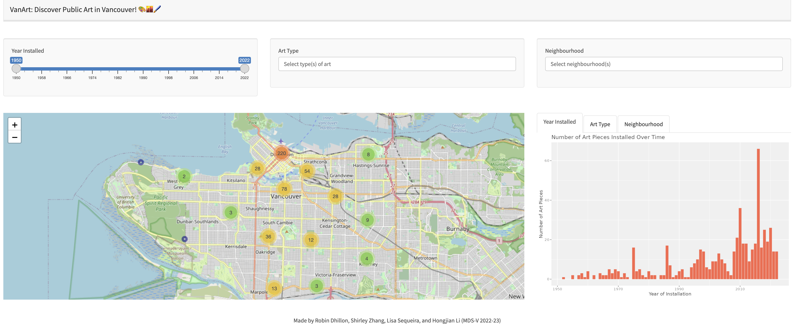

# VanArt
Welcome to explore public art in the city of Vancouver!

[Link to the VanArt app](https://shlrley.shinyapps.io/VanArt/)


-[Public Arts in Vancouver](#public-arts-in_vancouver)
-[VanArt Dashboard](#vanart-dashboard)
-[Data We Use](#data-we-use)
-[Run Locally](#run-locally)
-[Contributing](#contributing)
-[Authors](#authors)
-[License](#license)

## Public Arts in Vancouver

Public art is an important aspect of any city as it reflects the culture, history, and values of a community. Vancouver is known for its vibrant and diverse arts scene, and as a result, it has a plethora of public art installations that locals and tourists can explore. However, apart from some well-known museums that gather art collections together, with so many public art installations scattered throughout the city, it can be difficult for tourists to find the art they are interested in. As a result, we want to provide tourists with a centralized location to find information on public art in Vancouver.

## VanArt Dashboard



Our application contains three different panels:
-   `The interactivity filter panel`: As the user selects options on the panel on the top, 
    they will filter down the art icons visible on the map. The panel on the top will include 
    the year(s) when the art was installed, the type (or category) of art (mural, sculpture etc.), 
    and the neighborhood of interest. 
-   `The main map panel`: It displays the locations of the public art. When first opening the application 
    (without any user input) the map will display number of arts in each neighborhood. The user can also 
    interact with the map directly. When selecting an icon of interest, a panel will appear providing 
    the user all the details about that particular public art piece (including the name of the work, 
    an image of it, the artist name, its address and finally a website link with more information about the art).  
-   `The statistics panel`: Shows the user some basic statistics to accompany the map, based on the 
    filtered criteria the user entered in the left most panel. This panel will include a bar chart 
    to show the number of art pieces against the year installed, a heat map to show the types of art, 
    and a bar chart to show the number of art pieces by different neighborhood.

The interactivity filter panel and the statistics panel centered around the main map panel of Vancouver 
which . 


## Data We Use

The data set we used to create this App is modified from[City of Vancouver Open Data Portal](https://opendata.vancouver.ca/explore/dataset/public-art/export/)

Our modified data got rid from the art pieces that have been demolished and it contains the feature about: the title of the artwork, the type of art (mural, statue, etc.),address of artwork, neighborhood where the work is located, latitude and longitude of the artwork, the photo URL, URL with artwork information, brief introduction to the artwork, and the year artwork was installed.

## Authors:

    - Robin Dhillon
    - Shirley Zhang
    - Lisa Sequeira 
    - Hongjian Li

This data science project is created for DSCI 532 (Data Visualization II); a course in the Master of Data Science program at the University of British Columbia.

## Run Locally

To make this app run locally on your computer, please:
-   Clone or fork this repository first
-   Then, navigate to the top directory and run the command in the terminal below:

```{bash}
RScript app.R
```

## Contributing

Interested in contributing? You are welcomed to make contribution on VanArt App. We appreciate for your further thoughts including but not limited to:
-   The up-to-dated data that contains the information of more art pieces
-   The information of the artist of these public arts

Also, please check out the [contributing](CONTRIBUTING.md) guidelines. Please note that this project is released with a [Code of Conduct](CODE_OF_CONDUCT.md). By contributing to this project, you agree to abide by its terms.


## License

`VanArt` is licensed under the terms of the [MIT](LICENSE) license.
