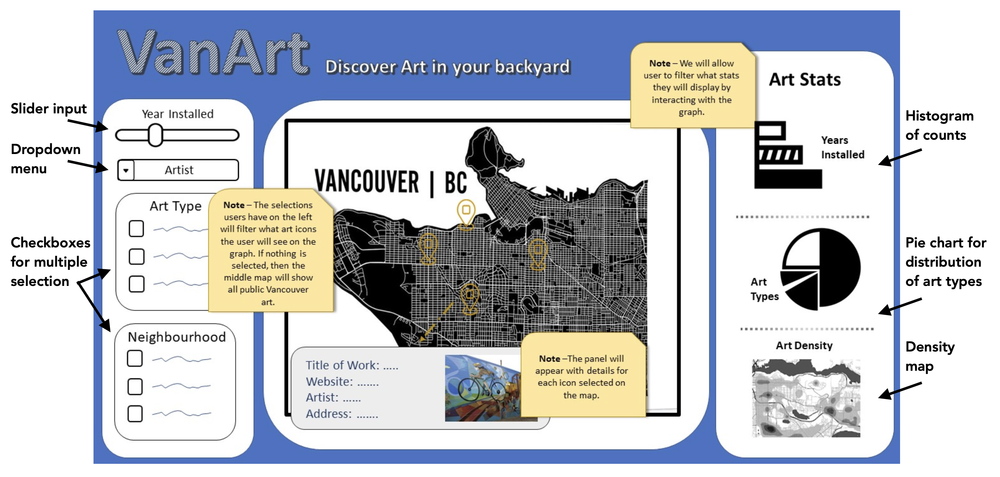

# VanArt

Welcome to VanArt! Our mission is to help you explore public art in the city of Vancouver 🎨🖌🌆

**Try out the app: [VanArt](https://shlrley.shinyapps.io/VanArt/)**

**Contents:** 
- Introduction 
- The Data 
- Dashboard Overview 
- Contributing 
- License 
- Authors 

## Introduction

**Application Description and Schematic**

Our application will contain three different panels, all centered around a map of Vancouver displaying the locations of the public art. When first opening the application (without any user input) the map will display all the art icons. As the user selects options on the left hand panel, they will filter down the art icons visible on the map. The panel on the left will include the year(s) when the art was installed, the type (or category) of art (mural, sculpture etc.), the artist name, and the neighbourhood of interest. The user can also interact with the map directly, when they select an icon of interest, a panel will appear providing the user all the details about that particular public art piece (including the name of the work, an image of it, the artist name, its address and finally a website link with more information about the art). Finally, the panel on the right hand side will show the user some basic statistics to accompany the map, based on the filtered criteria the user entered in the left most panel. This panel will include a bar chart to show the number of art pieces against the year installed, a pie chart to show the types of art, and a density graph to show areas where most of the art is found.

 

## Contributing

Interested in contributing? Check out the [contributing](CONTRIBUTING.md) guidelines. Please note that this project is released with a [Code of Conduct](CODE_OF_CONDUCT.md). By contributing to this project, you agree to abide by its terms.

## License

`VanArt` is licensed under the terms of the [MIT](LICENSE) license.

## Authors:

- Robin Dhillon
- Shirley Zhang
- Lisa Sequeira 
- Hongjian Li

This data science project is created for DSCI 532 (Data Visualization II); a course in the Master of Data Science program at the University of British Columbia.
